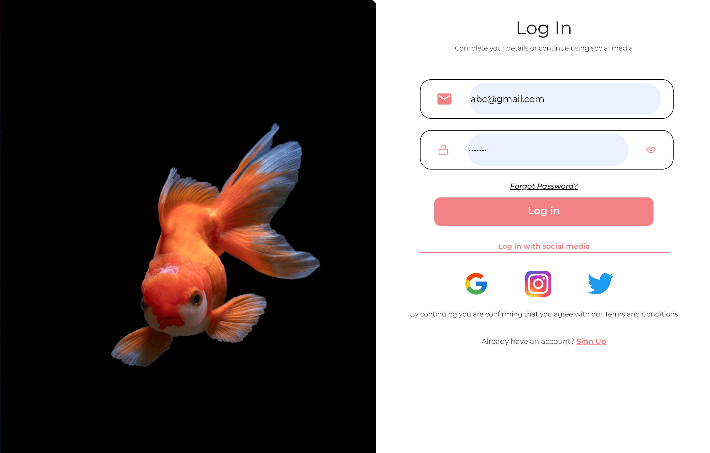
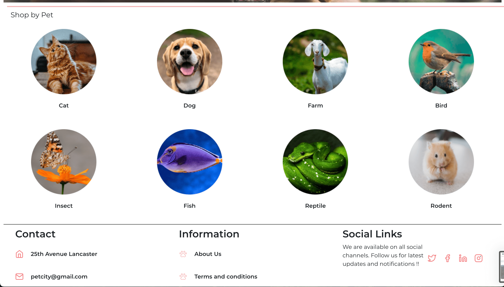
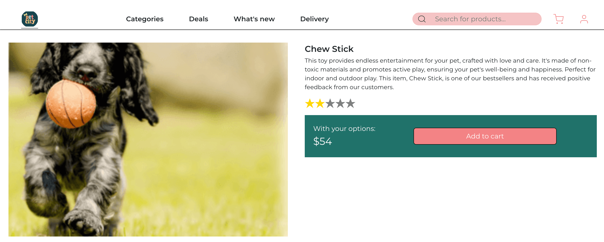

# PetCity

PetCity is an online pet store web application where users can explore and purchase a variety of pet products. The website provides features such as user registration, product browsing by category (e.g., food or medicines), adding products to the cart, and secure checkout facilitated by the Stripe API.

## Features

- **User Authentication:**
  - Users can register and log in securely using Google Firebase Authentication.

- **Product Categories:**
  - Browse a variety of pet products categorized by types, such as food or medicines.
  
  
  
  

- **Shopping Cart:**
  - Add desired products to the shopping cart for easy checkout.
  

- **Stripe Checkout:**
  - Secure and seamless checkout experience facilitated by the Stripe API.
  

## Tech Stack

- **Frontend:**
  - React

- **Authentication:**
  - Google Firebase Authentication

- **Database:**
  - Google Firestore

- **Payment Processing:**
  - Stripe API

- **Serverless Functions:**
  - Netlify Serverless Functions

